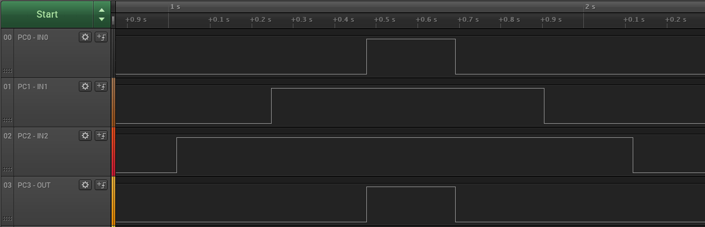

# Logic AND Gate

This code example shows how to configure the Configurable Custom Logic (CCL) peripheral to implement an AND gate with three inputs. The output of the look-up table is routed to an external pin.

## Related Documentation
More details and code examples on the ATMEGA4809 can be found at the following links:
- [TB3218 - Getting Started with Configurable Custom Logic (CCL)](https://ww1.microchip.com/downloads/en/Appnotes/TB3218-Getting-Started-with-CCL-DS90003218.pdf)
- [ATMEGA4809 Product Page](https://www.microchip.com/wwwproducts/en/ATMEGA4809)
- [ATMEGA4809 Code Examples on GitHub](https://github.com/microchip-pic-avr-examples?q=atmega4809)
- [ATMEGA4809 Project Examples in START](https://start.atmel.com/#examples/ATMEGA4809XplainedPro)

## Software Used
- Microchip Studio 7.0.2542 or newer [(https://www.microchip.com/mplab/microchip-studio)](https://www.microchip.com/mplab/microchip-studio)
- ATmega_DFP 1.5.362 or newer Device Pack

## Hardware Used
- ATMEGA4809 Xplained Pro [(ATMEGA4809-XPRO)](https://www.microchip.com/developmenttools/ProductDetails/ATMEGA4809-XPRO)

## Setup
The ATMEGA4809 Xplained Pro Development Board is used as test platform.

 

The following configurations must be made for this project:

System clock: 3.33 MHz (default)

CCL - LUT1:
-   LUT enabled
-   LUT-IN0: IN0 selected
-   LUT-IN1: IN1 selected
-   LUT-IN2: IN2 selected
-   LUT output enabled
-   Truth table = 0x80
-   CCL enabled

| Pin |  Configuration    |
| :-: | :---------------: |
| PC0 (LUT1-IN0) |   Digital input  |
| PC1 (LUT1-IN1) |   Digital input  |
| PC2 (LUT1-IN2) |   Digital input  |
| PC3 (LUT1-OUT) |   Digital output  |

 ## Operation
 1. Connect the board to the PC.

 2. Open the atmega4809-getting-started-with-ccl-studio.atsln solution in Microchip Studio.

 3. Set the **Logic_AND_Gate** project as start-up project. Right click on the project in the **Solution Explorer** tab and click **Set as StartUp Project**.

 

 4. Build the **Logic_AND_Gate** project: Right click on the **atmega4809-getting-started-with-ccl-studio** solution and select **Build Solution**.

 

 5. Select the **ATMEGA4809 Xplained Pro** in the Connected Hardware Tool section of the project settings:
   - Right click on the project and click **Properties**
   - Click on the **Tool** tab
   - Select the **ATMEGA4809 Xplained Pro** (click on the **SN**) in the Selected debugger/programmer section, and save (CTRL + S):

 

 6. Program the project to the board: Click on the **Debug** tab and click **Start Without Debugging**.

 

## Demo

The table below presents the truth table for an AND gate with three inputs:

| IN0 | IN1 | IN2 | OUT |
| :-: | :-: | :-: | :-: |
| `LOW`  | `LOW`  | `LOW`  | `LOW`  |
| `LOW`  | `LOW`  | `HIGH` | `LOW`  |
| `LOW`  | `HIGH` | `LOW`  | `LOW`  |
| `LOW`  | `HIGH` | `HIGH` | `LOW`  |
| `HIGH` | `LOW`  | `LOW`  | `LOW`  |
| `HIGH` | `LOW`  | `HIGH` | `LOW`  |
| `HIGH` | `HIGH` | `LOW`  | `LOW`  |
| `HIGH` | `HIGH` | `HIGH` | `HIGH` |

The picture below shows how the output (PC3) changes according to the gate inputs (PC0, PC1 and PC2).

 

## Summary

This code example shows how to configure the CCL peripheral to implement a logic AND gate with three inputs.
