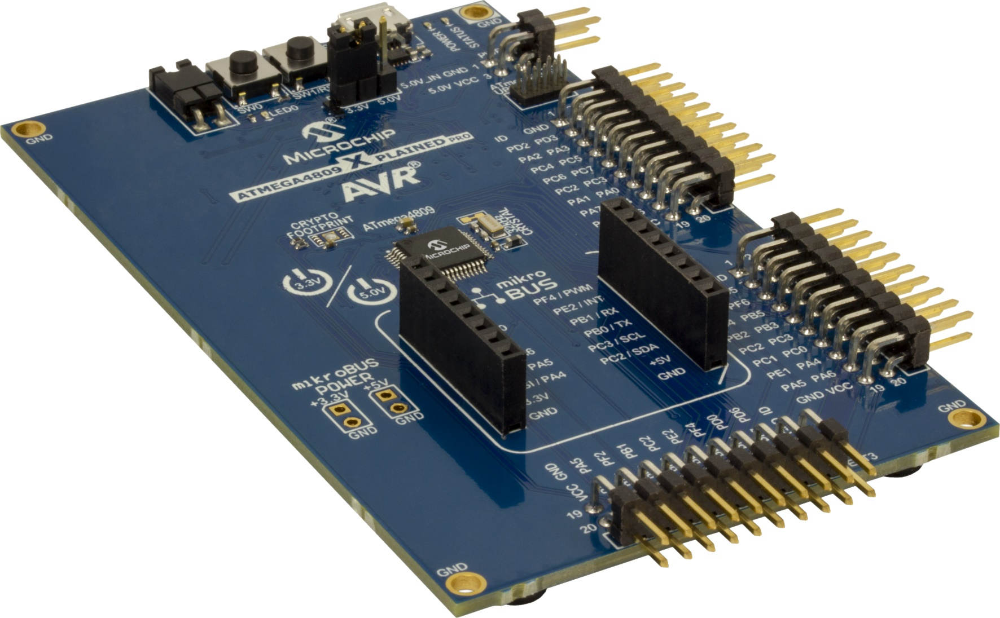

# SR Latch

In this code example, the Configurable Custom Logic (CCL) is used to implement an SR latch. This functionality is created by using two adjacent LUTs (LUT0 and LUT1 for this example) connected through a sequential logic block. For the Set and Reset signals, two GPIO pins are used as inputs for the LUTs.

## Related Documentation
More details and code examples on the ATMEGA4809 can be found at the following links:
- [TB3218 - Getting Started with Configurable Custom Logic (CCL)](https://ww1.microchip.com/downloads/en/Appnotes/TB3218-Getting-Started-with-CCL-DS90003218.pdf)
- [ATMEGA4809 Product Page](https://www.microchip.com/wwwproducts/en/ATMEGA4809)
- [ATMEGA4809 Code Examples on GitHub](https://github.com/microchip-pic-avr-examples?q=atmega4809)
- [ATMEGA4809 Project Examples in START](https://start.atmel.com/#examples/ATMEGA4809XplainedPro)

## Software Used
- Microchip Studio 7.0.2542 or newer [(https://www.microchip.com/mplab/microchip-studio)](https://www.microchip.com/mplab/microchip-studio)
- ATmega_DFP 1.5.362 or newer Device Pack

## Hardware Used
- ATMEGA4809 Xplained Pro [(ATMEGA4809-XPRO)](https://www.microchip.com/developmenttools/ProductDetails/ATMEGA4809-XPRO)

## Setup
The ATMEGA4809 Xplained Pro Development Board is used as test platform.

 

The following configurations must be made for this project:

System clock: 3.33 MHz (default)

CCL:
-   CCL enabled
-   LUT0:
    -   LUT0-IN0: Masked
    -   LUT0-IN1: IN1
    -   LUT0-IN2: Masked
    -   Truth table = 0x01
    -   Output enabled
    -   Filter enabled
    -   LUT0 enabled
-   LUT1:
    -   LUT1-IN0: Masked
    -   LUT1-IN1: IN1
    -   LUT1-IN2: Masked
    -   Truth table = 0x01
    -   Filter enabled
    -   LUT1 enabled
-   Sequencer selected: RS

| Pin |  Configuration    |
| :-: | :---------------: |
| PA1 (LUT0-IN1) |   Digital input  |
| PC1 (LUT1-IN1) |   Digital input  |
| PA3 (LUT0-OUT) |   Digital output |

 ## Operation
 1. Connect the board to the PC.

 2. Open the atmega4809-getting-started-with-ccl-studio.atsln solution in Microchip Studio.

 3. Set the **SR_Latch** project as start-up project. Right click on the project in the **Solution Explorer** tab and click **Set as StartUp Project**.

 

 4. Build the **SR_Latch** project: Right click on the **atmega4809-getting-started-with-ccl-studio** solution and select **Build Solution**.

 

 5. Select the **ATMEGA4809 Xplained Pro** in the Connected Hardware Tool section of the project settings:
   - Right click on the project and click **Properties**
   - Click on the **Tool** tab
   - Select the **ATMEGA4809 Xplained Pro** (click on the **SN**) in the **Selected debugger/programmer** section, and save (CTRL + S):

 

 6. Program the project to the board: Click on the **Debug** tab and click **Start Without Debugging**.

 

## Demo

In this example, an active-low SR latch was implemented, having the following truth table:

| Set | Reset | Output
| :-: | :-: | :-: |
| `HIGH`  | `HIGH`  | `Hold State`      |
| `HIGH`  | `LOW`   | `Clear`           |
| `LOW`   | `HIGH`  | `Set`             |
| `LOW`   | `LOW`   | `Forbidden State` |

The picture below shows how the output of the sequencer (PA3) changes according to the active-low SR latch behaviour.

 

## Summary

This code example shows how to configure the CCL peripheral to implement an SR latch.
